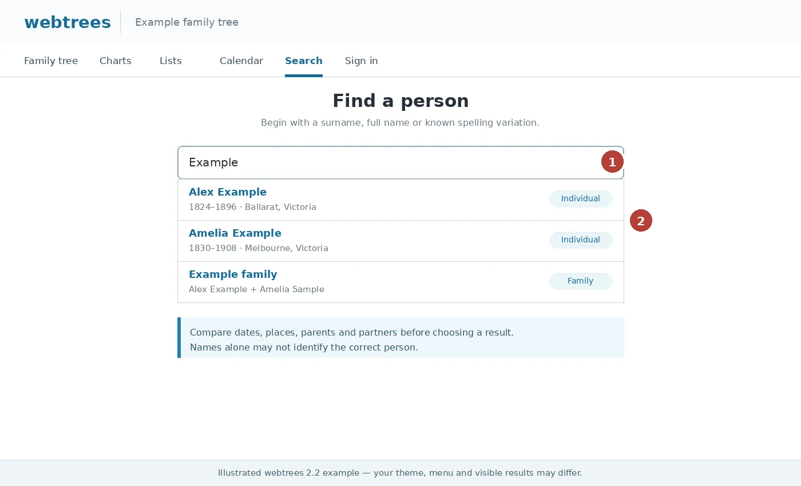
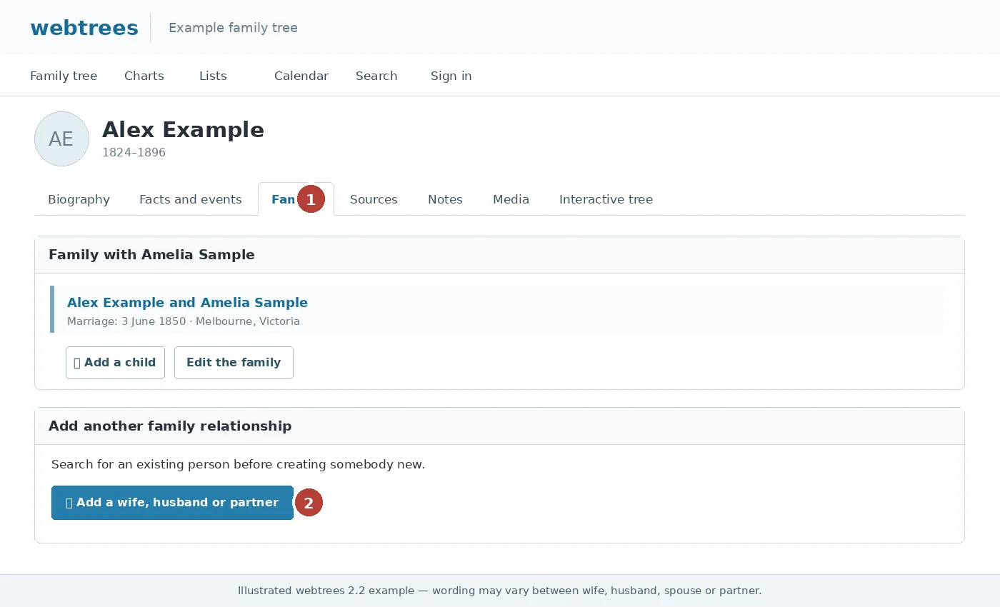
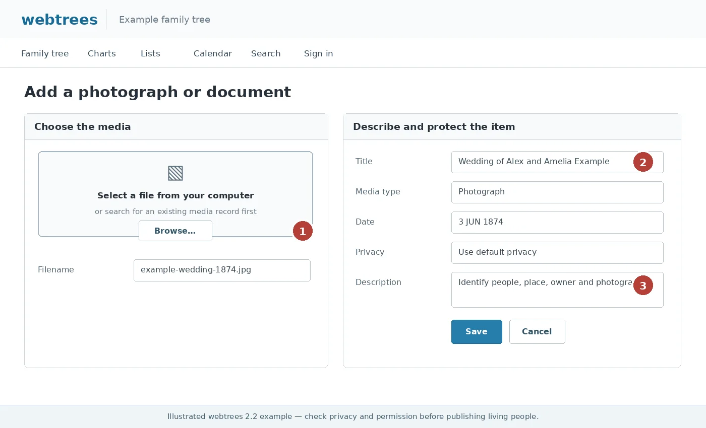
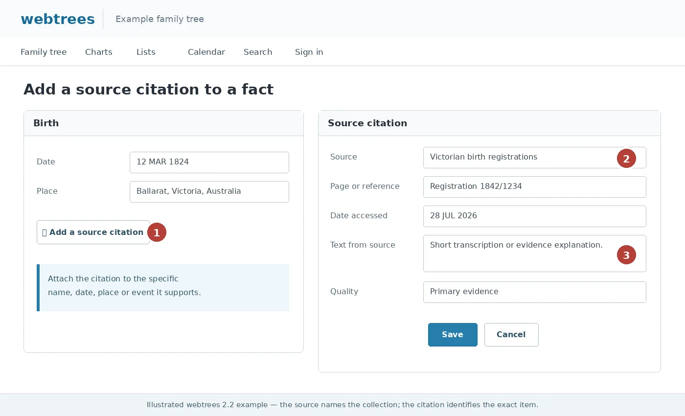

# Potts Help Centre

Potts Help Centre is a custom module for webtrees 2.2.x. It provides one inclusive, tree-specific help centre for signed-out visitors and registered members while automatically showing each audience the guidance relevant to them.

The public menu uses the compact label **Help**. The landing page identifies the current experience as **Visitor Help Centre** or **Member Help Centre**.

## Version 1.0.0-rc.1

This is the first release candidate for Potts Help Centre 1.0.0. It retains the existing `potts_member_help` folder, PHP namespace, module identity and database storage so upgrades preserve saved articles, settings and feedback.

### Highlights

- separate visitor, member and shared guidance within one inclusive Help Centre
- audience-specific **Quick help** cards for common tasks
- ranked multi-word search across titles, summaries, categories and article content
- topic browsing, article counts and an optional complete article list
- reading time, generated table of contents, print and copy-link actions
- previous, next and related-article navigation
- contextual help beside supported individual pages, family pages and editing forms
- administrator-editable articles with rich-text and plain-HTML editing modes
- publication, audience, Quick help, module requirement and ordering controls
- aggregate helpfulness feedback and an **Articles to review** panel
- optional article screenshots with captions, alternative text and source attribution
- twelve bundled illustrated guides using official webtrees material or fictional records
- automatic notice that screens may vary by theme, permissions and enabled modules
- theme-aware layouts tested for Potts Modern and designed for standard webtrees themes
- non-destructive upgrade behaviour for existing Potts Member Help installations

## Included guidance

The bundled starter guide contains 71 editable articles:

- 26 visitor articles
- 42 member articles
- 3 articles available to everyone
- 17 visitor and member topic categories

Guidance covers searching, individual pages, charts, privacy, accounts, people, relationships, facts, events, names, media, sources, research notes and responsible contribution.

## Screenshots

The bundled illustrations provide visual orientation without relying on private family data. Written instructions remain complete because the wording, position and availability of controls can vary between installations.

<table>
<tr>
<td width="50%"> <strong>Find a person</strong></td>
<td width="50%"> <strong>Add a partner</strong></td>
</tr>
<tr>
<td width="50%"> <strong>Add media</strong></td>
<td width="50%"> <strong>Add a citation</strong></td>
</tr>
</table>

See [`NOTICE.md`](NOTICE.md) and [`resources/screenshots/README.md`](resources/screenshots/README.md) for image sources and attribution.

## Optional Potts modules

Articles can be linked to supported optional modules and are shown only while every selected module is active:

- Potts Biography
- Potts Relationship Context
- Potts Historical Facts
- Potts Fact Ages
- Potts Modern Theme

Core webtrees articles have no module requirement.

## Visitor and member experiences

Set the menu module access level to **Visitor**. The module then determines the current audience from the selected family tree:

- signed-out users see the Visitor Help Centre
- registered tree members see the Member Help Centre
- administrators can preview either audience from the settings page

Each article can be assigned to **Visitors only**, **Registered members only** or **Everyone**.

## Quick help

The landing page displays a small set of common tasks before the topic categories. Administrators can feature any published article by selecting **Show in Quick help** in the article editor.

During the first upgraded visit, the module non-destructively marks the bundled common-task articles as featured. Administrators can then change or remove those selections.

## Contextual help

Optional contextual links can appear beside:

- individual-page tabs
- family pages
- editing forms and dialogs

The module recognises tasks such as adding a partner, child or parent, creating a person, editing a name, adding or editing an event, adding media and adding sources or citations. Guides open in a new tab by default to protect partially completed forms.

## Administration

Open **Control panel → Modules → All modules → Potts Help Centre**.

Administrators can:

- add, edit, publish, unpublish, feature, order and delete articles
- select visitor, member or shared audiences
- assign a topic category
- require optional modules
- preview visitor and member views
- filter the article list without reloading the page
- review aggregate feedback
- add missing starter articles
- refresh bundled starter content
- configure contextual help for each tree

Article bodies use webtrees’ CKEditor when it is active. A plain HTML field remains available as a fallback and saved content is sanitised by webtrees.

Each article can have one optional screenshot selected from the bundled library or supplied by a secure HTTPS address. Bundled files are preferred because an external image address contacts another server whenever the image is displayed. External screenshots are loaded with a no-referrer policy.

## Installation

1. Download the named release asset, not GitHub’s automatically generated source archive.
2. Extract the release ZIP.
3. Copy the enclosed `potts_member_help` folder to `webtrees/modules_v4/`, replacing the earlier folder when upgrading.
4. Enable **Potts Help Centre** under **Control panel → Modules → All modules**.
5. Enable its menu for the required family tree under **Control panel → Modules → Menus**.
6. Set the menu access level to **Visitor**.
7. Open the module settings page.

No SQL script or manual database migration is required. See [`INSTALL.md`](INSTALL.md) for detailed upgrade notes.

## Compatibility

- webtrees 2.2.x
- designed and checked against webtrees 2.2.6
- Potts modules are optional
- Potts Modern Theme is optional
- standard webtrees themes should remain supported

## Project links

- Repository: https://github.com/PottsNet/potts-help-centre
- Issues and support: https://github.com/PottsNet/potts-help-centre/issues
- Releases: https://github.com/PottsNet/potts-help-centre/releases

The GitHub repository name is separate from the module’s internal `potts_member_help` identity.

## Release status

`1.0.0-rc.1` is a release candidate. Complete the checks in [`TESTING.md`](TESTING.md) on an upgraded site and, where practical, a clean webtrees installation before publishing 1.0.0 as a full release.

## Licence

GPL-3.0-or-later. See [`LICENSE`](LICENSE). Third-party image attribution is recorded in [`NOTICE.md`](NOTICE.md).
